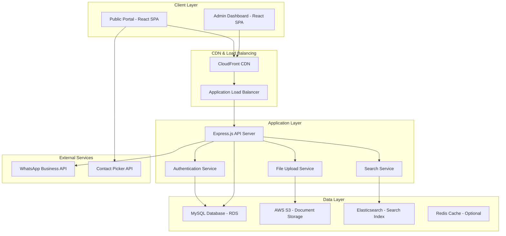
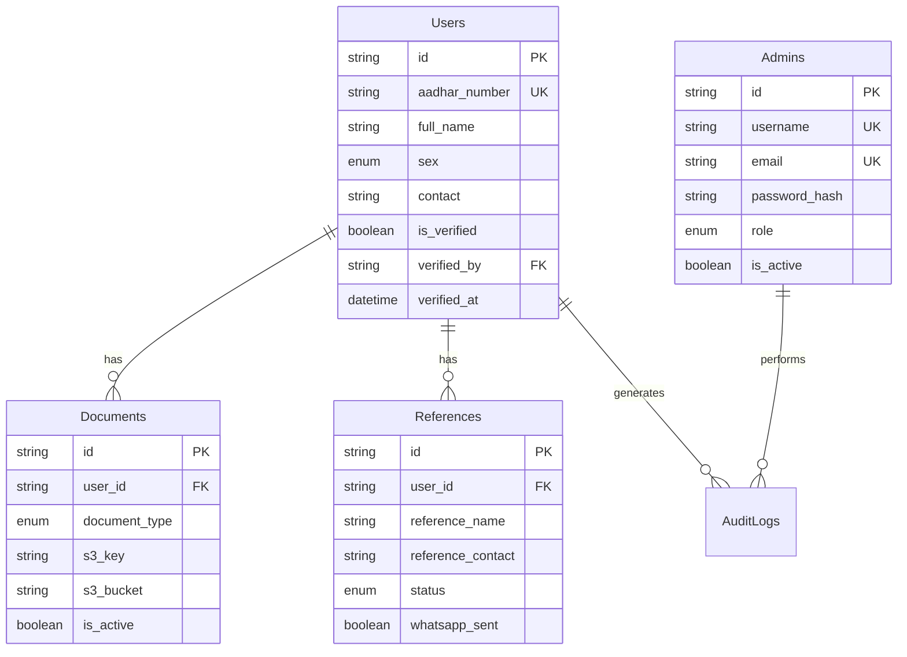

# Design Document

## Overview

The Padhvidhar Matdar Sangh voter management system is designed as a modern, scalable web application with a React-based frontend and Express.js backend. The architecture follows a three-tier pattern with clear separation between presentation, business logic, and data layers. The system leverages AWS cloud services for scalability, security, and reliability, with MySQL for structured data storage, S3 for document storage, and Elasticsearch for advanced search capabilities.

The system consists of two main user interfaces: a public enrollment portal for citizens and an administrative dashboard for voter management. Both interfaces share the same backend API but have different authentication mechanisms and access levels.

## Architecture

### High-Level Architecture



### Technology Stack

**Frontend:**

- React 18 with functional components and hooks
- React Router for client-side routing
- React Hook Form with Zod validation
- TanStack Table for data grids
- TanStack Query for server state management
- Tailwind CSS for styling
- Vite for build tooling

**Backend:**

- Node.js with Express.js framework
- Prisma ORM for database operations
- JWT for authentication
- Multer with S3 integration for file uploads
- Elasticsearch client for search functionality
- Winston for logging
- Helmet for security headers

**Database & Storage:**

- MySQL 8.0 on AWS RDS for relational data
- AWS S3 for document and image storage
- Elasticsearch for full-text search and filtering

**Infrastructure:**

- AWS EC2 for application hosting
- AWS RDS for managed database
- AWS S3 for file storage with CloudFront CDN
- AWS OpenSearch for managed Elasticsearch

## Components and Interfaces

### Frontend Components Architecture

#### Public Portal Components

**Core Components:**

- `AadharCheckModal`: Initial Aadhar number validation and user lookup
- `EnrollmentForm`: Multi-section form with validation and file uploads
- `UserDashboard`: Display and edit user information
- `DocumentUpload`: File upload with preview, compression, and cropping
- `ContactPicker`: Native contact selection with manual fallback
- `ReferenceManager`: Add and manage voter references

**Form Sections:**

- `PersonalInfoSection`: Name, sex, guardian, qualification, occupation
- `AddressSection`: Complete address information with city defaulting to PUNE
- `ElectorSection`: Conditional fields for registered electors
- `EducationSection`: University and graduation details
- `DocumentSection`: File uploads for Aadhar, degree, and photo

#### Admin Dashboard Components

**Layout Components:**

- `AdminLayout`: Main layout with sidebar navigation and header
- `Sidebar`: Navigation menu with role-based access control
- `StatsCard`: Dashboard statistics display

**Data Management Components:**

- `VotersTable`: Paginated table with search, filter, and sort capabilities
- `ReferencesTable`: Reference management with status updates
- `ManagersTable`: Admin user management (admin role only)
- `SearchBar`: Elasticsearch-powered search interface
- `FilterPanel`: Multi-criteria filtering interface

### Backend API Architecture

#### Service Layer Design

**UserService:**

- `createUser(userData, documents)`: Create new voter with document upload
- `getUserById(userId)`: Retrieve complete user information
- `updateUser(userId, updates)`: Update user information with audit logging
- `checkAadharExists(aadharNumber)`: Validate Aadhar uniqueness
- `verifyUser(userId, adminId)`: Admin verification with audit trail

**DocumentService:**

- `uploadDocument(userId, documentType, file)`: S3 upload with metadata storage
- `getDocumentUrl(documentId)`: Generate signed S3 URLs for secure access
- `replaceDocument(documentId, newFile)`: Replace existing document
- `deleteDocument(documentId)`: Soft delete with S3 cleanup

**ReferenceService:**

- `addReferences(userId, references)`: Add voter references
- `sendWhatsAppNotifications(references)`: Send WhatsApp messages to references
- `updateReferenceStatus(referenceId, status)`: Update reference verification status
- `getReferencesByUser(userId)`: Retrieve user references

**SearchService:**

- `indexUser(userData)`: Add/update user in Elasticsearch index
- `searchUsers(query, filters, pagination)`: Advanced user search
- `searchReferences(query, filters)`: Reference search functionality
- `deleteUserIndex(userId)`: Remove user from search index

#### Authentication & Authorization

**JWT Token Structure:**

```json
{
  "userId": "uuid",
  "type": "user|admin",
  "role": "admin|manager", // for admin tokens only
  "iat": 1234567890,
  "exp": 1234567890
}
```

**Authorization Middleware:**

- `authenticateUser`: Validate user JWT tokens
- `authenticateAdmin`: Validate admin JWT tokens
- `requireRole(roles)`: Role-based access control for admin functions
- `rateLimitByUser`: User-specific rate limiting

## Data Models

### Database Schema Design

#### Core Entities

**Users Table:**

- Primary entity storing all voter information
- Includes personal details, address, elector information, and education
- Soft verification status with admin tracking
- Audit timestamps for creation and updates

**Documents Table:**

- Stores metadata for uploaded files
- Links to S3 objects with bucket and key information
- Supports document replacement with history tracking
- File validation metadata (size, type, upload timestamp)

**References Table:**

- Voter reference information with contact details
- WhatsApp notification tracking
- Status progression (pending → contacted → applied)
- Audit trail for status changes

**Admins Table:**

- Administrative user accounts with role-based access
- Secure password hashing with bcrypt
- Session management and last login tracking
- Hierarchical roles (admin > manager)

**AuditLogs Table:**

- Comprehensive action logging for all system operations
- Tracks entity changes with before/after states
- IP address and user agent logging for security
- Supports both user and admin action tracking

#### Relationships and Constraints



### Data Validation Rules

**User Data Validation:**

- Aadhar: Exactly 12 digits, unique across system
- Contact: 10-digit mobile number, unique per user
- Email: Valid email format, optional
- Age: Calculated from DOB, must be 18+ for voter eligibility
- Documents: Required Aadhar and photo, degree certificate for graduates

**File Upload Validation:**

- Maximum file size: 5MB per document
- Allowed formats: JPG, PNG, PDF
- Image compression: Automatic compression for images >1MB
- Virus scanning: Integration with AWS S3 malware detection

## Error Handling

### Error Classification and Response Strategy

#### Client-Side Error Handling

**Validation Errors:**

- Real-time form validation with Zod schemas
- Field-level error messages with user-friendly text
- Form submission prevention until all errors resolved
- Visual indicators for invalid fields

**Network Errors:**

- Automatic retry for transient failures
- Offline detection with user notification
- Request timeout handling with user feedback
- Connection error recovery strategies

**File Upload Errors:**

- Progress indication with cancel capability
- File size and type validation before upload
- Upload failure recovery with retry options
- Partial upload cleanup and restart

#### Server-Side Error Handling

**API Error Response Format:**

```json
{
  "success": false,
  "error": {
    "code": "VALIDATION_ERROR",
    "message": "User-friendly error message",
    "details": {
      "field": "aadhar_number",
      "reason": "Already exists in system"
    },
    "timestamp": "2024-01-01T00:00:00Z",
    "requestId": "uuid"
  }
}
```

**Error Categories:**

- `VALIDATION_ERROR`: Input validation failures
- `AUTHENTICATION_ERROR`: Auth token issues
- `AUTHORIZATION_ERROR`: Permission denied
- `NOT_FOUND_ERROR`: Resource not found
- `DUPLICATE_ERROR`: Unique constraint violations
- `FILE_UPLOAD_ERROR`: Document upload failures
- `EXTERNAL_SERVICE_ERROR`: Third-party service failures
- `INTERNAL_ERROR`: Unexpected server errors

**Error Logging Strategy:**

- All errors logged with Winston logger
- Error correlation with request IDs
- Sensitive data exclusion from logs
- Error aggregation and alerting setup

### Database Error Handling

**Transaction Management:**

- Atomic operations for multi-table updates
- Rollback on any operation failure
- Connection pool management with retry logic
- Deadlock detection and retry mechanisms

**Data Integrity:**

- Foreign key constraint enforcement
- Unique constraint validation
- Data type validation at database level
- Backup and recovery procedures

## Testing Strategy

### Testing Pyramid Approach

#### Unit Testing (70% of tests)

**Backend Unit Tests:**

- Service layer function testing with Jest
- Database operation mocking with Prisma
- Authentication middleware testing
- Validation schema testing
- File upload utility testing

**Frontend Unit Tests:**

- Component testing with React Testing Library
- Hook testing with custom test utilities
- Form validation testing
- Utility function testing
- State management testing

#### Integration Testing (20% of tests)

**API Integration Tests:**

- End-to-end API workflow testing with Supertest
- Database integration with test database
- S3 upload/download integration testing
- Elasticsearch indexing and search testing
- WhatsApp API integration testing

**Frontend Integration Tests:**

- Component interaction testing
- Form submission workflows
- File upload integration
- Authentication flow testing
- Navigation and routing testing

#### End-to-End Testing (10% of tests)

**Critical User Journeys:**

- Complete voter enrollment process
- Document upload and replacement workflow
- Admin login and voter verification process
- Search and filter functionality
- Reference management workflow

**Testing Tools:**

- Playwright for E2E browser testing
- Test data factories for consistent test setup
- Visual regression testing for UI consistency
- Performance testing for critical paths
- Accessibility testing with axe-core

### Test Environment Strategy

**Test Database:**

- Separate test database with identical schema
- Automated test data seeding and cleanup
- Transaction rollback for test isolation
- Performance testing with production-like data volume

**Mock Services:**

- S3 operations mocking for unit tests
- WhatsApp API mocking for integration tests
- Elasticsearch mocking for search tests
- Contact Picker API mocking for frontend tests

### Continuous Testing Integration

**Pre-commit Hooks:**

- Lint and format checking
- Unit test execution
- Type checking with TypeScript
- Security vulnerability scanning

**CI/CD Pipeline Testing:**

- Automated test suite execution on pull requests
- Integration test execution in staging environment
- Performance regression testing
- Security scanning with OWASP tools
- Accessibility compliance checking
